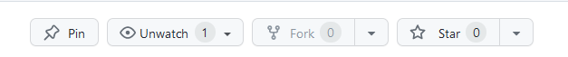
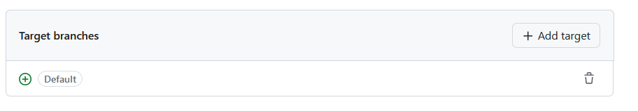
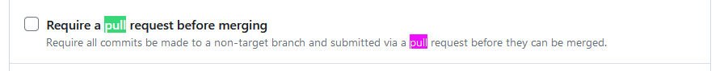

To repozytorium ma na celu pomóc zrozumieć podstawową konfigurację repozytorium na GitHubie, zawierającego:
- CI zrealizowane z wykorzystaniem GitHub Actions
- ustawienia polityki dostępu do repozytorium
- deployment z wykorzystaniem GitHub Pages.

Pierwszym krokiem do zrealizowania jest wykonanie forka tego repozytorium do swojego profilu

(trzeci przysik od lewej na ss)

Gdy repozytorium jest już sklonowane do naszego profilu możemy zacząć konfiguracje CI.

W repozytorium znajduje się kod który zawiera dwie częśći backednową oraz frontendową które dostarczają podsrawowe testy uruchamiane w różny sposób, co pozwoli nam zapoznać się z działaniem github actions.

Zanim zaczniemy musimy odpowiedzieć na pytanie czym są github actions, możemy je rozumieć jako małe programy których uruchomienie jest trigerowane przez konkretne wydarzenia (eventy) na naszym repozytorium i pozwalają nam na automatyzacje procesów związanych z rozwojem naszego projektu.

Precyzyjniejszy opis tego wszystkiego co znajduje się ponieżej można znaleźć w dokumetacji samych github actions:
https://docs.github.com/en/actions/learn-github-actions/understanding-github-actions

Czym więc są eventy w naszym repozytorium, mówiąc ogólnie są to wszystkie acje wykonwane na kodzie i samym repo mogą to więc być:
- commity
- pull requesty
- otwarcia isue
- merge do jakiegoś konkretnego brancha itd..

**Eventy trigerują workflows** które wykonują konkretny kawałek roboty związany z automatyzacją.
Jeden workflow może składać się z **jednego lub więcej jobów** podzielownych na **wykonywane sekwencyjnie stepy**.

1. Przygotowanie pierwszego workflow
    
    Workflow któy teraz przygotujemy bęzie odpowaidał za uruchomienie testów
    i będzie się składał z dwóch jobów jednego odpowiedzialnego z frontend drugiego za backend.
    
    Wszystkie workflow opisujemy za pomocą plików `*.yml` i umieszczamy w katalogu
    `.github/workflows/`.

    Plik który będzie odpowiadał za realizację workflow nazwiemy `tests.yml`

    Jego treść z komentarzem wyjaśniającym poszczegulne kroki znajduje się w katalogu /resources.
   
    Po pushu naszych zmian w zakładce actions powinniśmy zauważyć uruchomienie naszego workflow:

    Wykonania work flow możemy filtrować po eventach je trigerujących,statusach,branchach itd...

Po kliknięciu w wykonanie konkretnego workflow możemy zobaczyć jego status i szczegóły wykonania:

w prawym górnym rogu istnieje możliwość ponownego uruchomienia wszystkich jobów bez konieczności kolejnego występienia eventu.
Jak widzimy testy dla backendu zakończyły się niepowodzniem. Aby sprawdzić co poszło nie tek klikamy joba zakończonego niepowodzeniem co pozwala nam zobaczyć wszystkie stepy:

Klikamy czerwony krok i po rozwinięcu wizimy że:

Możemy to szybko naprawić przechodząć do klasy `pl/agh/slonik/githubactiosns/sample/core/model/Student.java` i dodając wszystki pola do funkcji to string usuwajć `    @ToString.Exclude
`

Po tej zmianie wszyskie testy powinny być zielone :)

2. Ustawienia polityki dostępu do repozytorium

    Podczas pracy nad projektem z większą liczbą osób dojdziemy prawdopodobnie do wniosku, że niekoniecznie chcemy pozwolić na mergowanie każdego commita do głównego brancha bez PR.
    Możemy się przed tym i wieloma innymi rzeczami zabezpieczyć zmieniając politykę repozytorium, aby to zrobić przechodzimy do zakładki settings:
    
    Warto zapoznać się z tym co możemy tu wyklikać, ale narazie przejdziemy do zakładki:

    i ustawimy blokadę na pushe i merge do mastera (zdezaktualizuje to nasze wcześniej skonfigurowane github actions reagujące na push do mastera ale tym się nie przejmujemy :) )
    
    Klikamy create new rule set:

    a następnie branch rule set, ustawiamy nazwę rule set na master-protection a status na active:
[img_7.png](img_7.png)
pomijamy część odpowiedzialną za wyjątki:

i wybieramy branch dla którego będzie działać nasza polityka:

A następnie regułę:

Po wybraniu ograniczeń klikamy create.

Opcji konfiguracji polityki jest bardzo dużo i warto się z nimi zapoznać, pozwalają na wykorzystanie github actions i wiele więcej.

3. Deployment z wykorzystaniem GitHub Pages
Proste strony mogą zostać zdeployowane za pomocą github pages za darmo, w naszym przypadku frontend nie komunikuje się z backendem więc można skorzystać z tej funkcjonalności.

Link do dokumntacji github pages:
https://docs.github.com/en/pages/quickstart

Najpierw dodajmy `"homepage": "https://<github-username>.github.io/<repo-name>/",` do naszego pliku package.json w katalogu frontend bęzie to link gdzie dostępna będzie nasza strona.
<github-username> i  <repo-name> podmieniamy na nazwę użytkownika i repozytorium.

Wykorzystamy tutaj wiedzę z punktu pierwszego i utworzymy plik yml w katalogu workflows który będzie nazywał się `deploy.yml`

    
    
    

