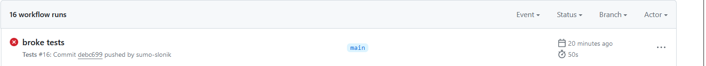
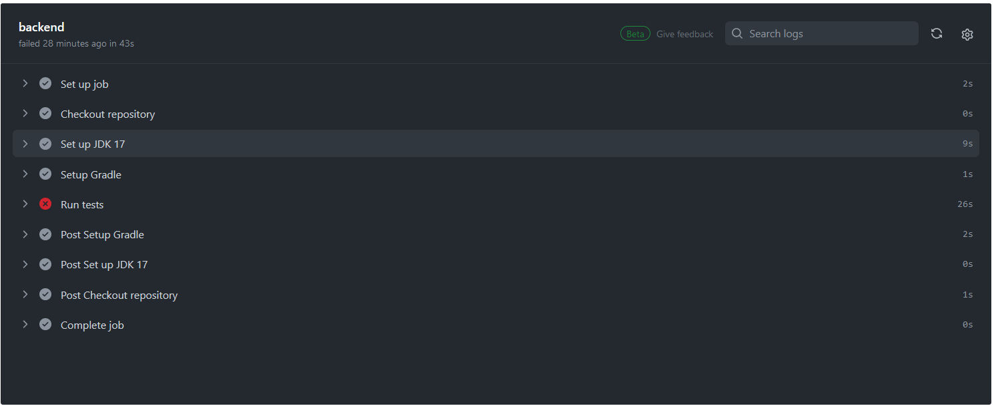
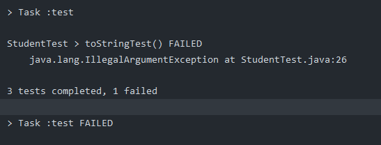
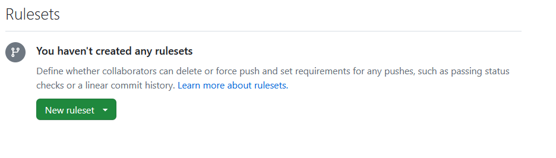
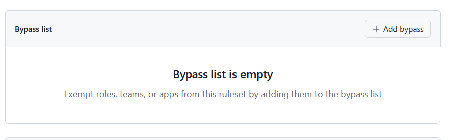
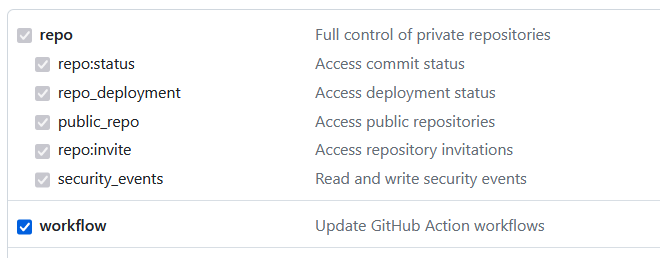
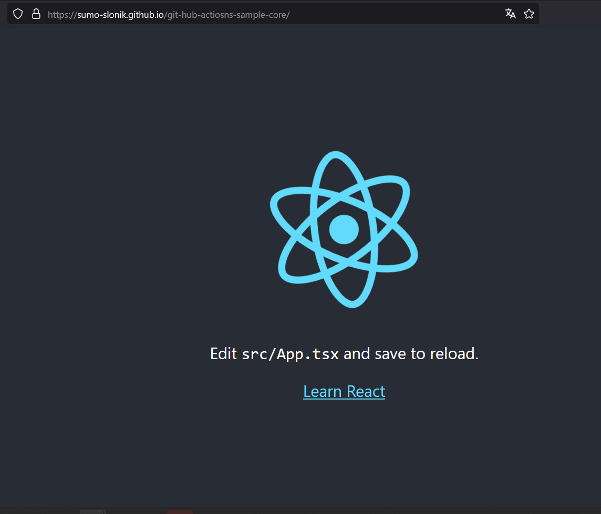

# Repozytorium GitHub z CI i Deploymentem

To repozytorium ma na celu pomoc w zrozumieniu podstawowej konfiguracji repozytorium na GitHubie, zawierającego:

- CI zrealizowane z wykorzystaniem GitHub Actions
- ustawienia polityki dostępu do repozytorium
- deployment z wykorzystaniem GitHub Pages.

Pierwszym krokiem do zrealizowania jest wykonanie forka tego repozytorium do swojego profilu.

Gdy repozytorium jest już sklonowane do naszego profilu, możemy zacząć konfigurację CI.

W repozytorium znajduje się kod, który zawiera dwie części: backendową oraz frontendową, które dostarczają podstawowe testy uruchamiane w różny sposób, co pozwoli nam zapoznać się z działaniem GitHub Actions.

Zanim zaczniemy, musimy odpowiedzieć na pytanie, czym są GitHub Actions. Możemy je rozumieć jako małe programy, których uruchomienie jest wywoływane przez konkretne wydarzenia (eventy) na naszym repozytorium i pozwalają nam na automatyzację procesów związanych z rozwojem naszego projektu.

Precyzyjniejszy opis wszystkiego, co znajduje się poniżej, można znaleźć w dokumentacji GitHub Actions: [Understanding GitHub Actions](https://docs.github.com/en/actions/learn-github-actions/understanding-github-actions).

## Eventy w naszym repozytorium

Mówiąc ogólnie, eventy w naszym repozytorium to wszystkie akcje wykonane na kodzie i samym repozytorium, mogą to więc być:

- commity
- pull requesty
- otwarcia issue
- merge do konkretnego brancha itd.

**Eventy trigerują workflows**, które wykonują konkretny kawałek roboty związany z automatyzacją. Jeden workflow może składać się z **jednego lub więcej jobów**, podzielonych na **wykonywane sekwencyjnie kroki (steps)**.

### 1. Przygotowanie pierwszego workflow

Workflow, który teraz przygotujemy, będzie odpowiedzialny za uruchomienie testów i składać się z dwóch jobów: jednego odpowiedzialnego za frontend, drugiego za backend.

Wszystkie workflow opisujemy za pomocą plików `*.yml` i umieszczamy w katalogu `.github/workflows/`.

Plik, który będzie odpowiadał za realizację workflow, nazwiemy `tests.yml`.

Jego treść, z komentarzem wyjaśniającym poszczególne kroki, znajduje się w katalogu `/resources`.

Po pushu naszych zmian w zakładce "Actions" powinniśmy zauważyć uruchomienie naszego workflow:

Wykonania workflow możemy filtrować po eventach je trigerujących, statusach, branchach itd...

Po kliknięciu w wykonanie konkretnego workflow możemy zobaczyć jego status i szczegóły wykonania:

W prawym górnym rogu istnieje możliwość ponownego uruchomienia wszystkich jobów bez konieczności kolejnego wystąpienia eventu.

Jak widzimy, testy dla backendu zakończyły się niepowodzeniem. Aby sprawdzić, co poszło nie tak, klikamy joba zakończonego niepowodzeniem, co pozwala nam zobaczyć wszystkie kroki:

Klikamy czerwony krok, a po rozwinięciu widzimy, że:

Możemy to szybko naprawić, przechodząc do klasy `pl/agh/slonik/githubactiosns/sample/core/model/Student.java` i usuwając `@ToString.Exclude` z wszystkich pól funkcji `toString`.

Po tej zmianie wszystkie testy powinny być zielone ✅ 

### 2. Ustawienia polityki dostępu do repozytorium

Podczas pracy nad projektem z większą liczbą osób dojdziemy prawdopodobnie do wniosku, że niekoniecznie chcemy pozwolić na mergowanie każdego commita do głównego brancha bez PR. Możemy się przed tym i wieloma innymi rzeczami zabezpieczyć, zmieniając politykę repozytorium. Aby to zrobić, przechodzimy do zakładki "Settings":

Warto zapoznać się z tym, co możemy tu wyklikać, ale na razie przejdziemy do zakładki:

I ustawimy blokadę na pushe i merge do mastera. To zdezaktualizuje nasze wcześniej skonfigurowane GitHub Actions reagujące na push do mastera, ale tym się nie przejmujemy :)

Klikamy "Create new rule set":

A następnie "Branch rule set". Ustawiamy nazwę rule set na "master-protection" a status na "active":

Pomijamy część odpowiedzialną za wyjątki:

I wybieramy branch dla którego będzie działać nasza polityka:

A następnie regułę:

Po wybraniu ograniczeń klikamy "Create".

Opcji konfiguracji polityki jest bardzo dużo i warto się z nimi zapoznać, pozwalają na wykorzystanie GitHub Actions i wiele więcej.

### 3. Deployment z wykorzystaniem GitHub Pages

Proste strony mogą zostać zdeployowane za pomocą GitHub Pages za darmo. W naszym przypadku frontend nie komunikuje się z backendem, więc możemy skorzystać z tej funkcjonalności.

Link do dokumentacji GitHub Pages: [GitHub Pages Quickstart](https://docs.github.com/en/pages/quickstart)

Najpierw dodajmy `"homepage": "https://<github-username>.github.io/<repo-name>/",` do naszego pliku `package.json` w katalogu frontend. Będzie to link, gdzie dostępna będzie nasza strona. `<github-username>` i `<repo-name>` podmieniamy na nazwę użytkownika i nazwę repozytorium.

Następnie musimy wygenerować token, który umożliwi buildowi stworzenie brancha z zdeployowaną stroną i dodać ten token jako sekret naszego repozytorium. Wchodzimy na stronę: [GitHub Tokens](https://github.com/settings/tokens) i generujemy token z następującymi uprawnieniami:

Tak wygenerowany token kopiujemy i przechodzimy do ustawień repozytorium, a następnie do:

Settings -> Security -> Actions -> Secrets & Variables

Tworzymy nowy sekret, który nazwiemy `TOKEN`, i zapisujemy tam nasz wygenerowany token. Następnie, do katalogu workflows dodajemy plik `deploy.yml` który można znaleźć w katalogu `resources`.

Teraz po wykonaniu merga do mastera zostanie zdeployowany frontend na link podany w pliku `package.json`.

    
    
    

